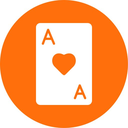

# 🃏 CardRush

> Fast-paced UNO-style card game — beat 3 AI opponents, works offline, installable as a PWA.



**[▶ Play Now]( https://cardrushh.netlify.app)** <!-- replace with your Netlify URL -->

---

## 🎮 Features

- **UNO-style gameplay** — Number cards, Skip, Reverse, Draw 2, Wild, and Wild Draw 4
- **3 AI opponents** with unique personalities:
  - 🔥 **Blaze** — Aggressive. Plays power cards without mercy.
  - ❄️ **Chill** — Passive. Calm and steady.
  - 🎭 **Trix** — Trickster. Unpredictable chaos.
- **1–3 AI opponents** — choose your difficulty by opponent count
- **Stats tracking** — wins, losses, and win streak saved locally
- **PWA support** — install to your home screen and play offline
- **Mobile-first design** — portrait layout optimised for phones
- **No login, no ads, no backend** — pure client-side fun

---

## 📸 Screenshots

<!-- Add screenshots here once deployed -->
| Landing | Game | End Screen |
|---------|------|------------|
| _coming soon_ | _coming soon_ | _coming soon_ |

---

## 🚀 Getting Started

### Play instantly
Visit the live site (no install needed): **[your-netlify-url.netlify.app](#)**

### Install as an app (PWA)
- **Android/Chrome:** tap the browser menu → *Add to Home Screen*
- **iOS/Safari:** tap Share → *Add to Home Screen*

---

## 🛠 Local Development

**Requirements:** Node.js 18+

```bash
# Clone the repo
git clone https://github.com/your-username/cardrush.git
cd cardrush

# Install dependencies
npm install

# Start dev server
npm run dev
```

Open [http://localhost:5173](http://localhost:5173) in your browser.

```bash
# Production build
npm run build

# Preview the production build locally
npm run preview
```

---

## 📦 Tech Stack

| Layer | Technology |
|-------|-----------|
| Framework | [React 18](https://react.dev/) |
| Build tool | [Vite 5](https://vitejs.dev/) |
| Styling | Inline CSS + CSS animations (no CSS framework) |
| PWA | Web App Manifest + Service Worker |
| Fonts | [Orbitron](https://fonts.google.com/specimen/Orbitron) via Google Fonts |
| Hosting | [Netlify](https://netlify.com) |

Zero runtime dependencies beyond React.

---

## 🌐 Deployment (Netlify)

The repo includes a `netlify.toml` — everything is pre-configured.

### Option 1 — Git deploy (auto-redeploy on push)
1. Push this repo to GitHub
2. Go to [app.netlify.com](https://app.netlify.com) → **Add new site → Import from Git**
3. Select your repo — Netlify auto-detects the build settings
4. Click **Deploy** ✅

### Option 2 — Drag & drop
```bash
npm run build
```
Drag the `dist/` folder onto [app.netlify.com](https://app.netlify.com/drop).

### Option 3 — Netlify CLI
```bash
npm install -g netlify-cli
npm run build
netlify deploy --prod --dir=dist
```

---

## 📁 Project Structure

```
cardrush/
├── public/
│   ├── favicon.ico
│   ├── icon-*.png       # PWA icons (16px – 512px)
│   ├── manifest.json    # PWA manifest
│   └── sw.js            # Service worker (offline support)
├── src/
│   ├── App.jsx          # Entire game (screens + logic)
│   └── main.jsx         # React entry point
├── index.html
├── vite.config.js
├── netlify.toml         # Build & redirect config
└── package.json
```

---

## 🎯 How to Play

1. Choose the number of AI opponents (1–3)
2. Each player starts with **7 cards**
3. On your turn, play a card that matches the **colour or number** of the top card
4. Special cards:
   - **Skip (⊘)** — next player loses their turn
   - **Reverse (↺)** — reverses turn order
   - **Draw 2 (+2)** — next player draws 2 cards
   - **Wild (★)** — change the colour to anything
   - **Wild Draw 4 (★4)** — change colour + next player draws 4
5. Can't play? Draw a card from the deck
6. First player to empty their hand **wins!**

---

## 📄 License

MIT --

Copyright (c) 2026 Saikot Islam Abir

Permission is hereby granted, free of charge, to any person obtaining a copy
of this software and associated documentation files (the "Software"), to deal
in the Software without restriction, including without limitation the rights
to use, copy, modify, merge, publish, distribute, sublicense, and/or sell
copies of the Software, and to permit persons to whom the Software is
furnished to do so, subject to the following conditions:

The above copyright notice and this permission notice shall be included in all
copies or substantial portions of the Software.

THE SOFTWARE IS PROVIDED "AS IS", WITHOUT WARRANTY OF ANY KIND, EXPRESS OR
IMPLIED, INCLUDING BUT NOT LIMITED TO THE WARRANTIES OF MERCHANTABILITY,
FITNESS FOR A PARTICULAR PURPOSE AND NONINFRINGEMENT. IN NO EVENT SHALL THE
AUTHORS OR COPYRIGHT HOLDERS BE LIABLE FOR ANY CLAIM, DAMAGES OR OTHER
LIABILITY, WHETHER IN AN ACTION OF CONTRACT, TORT OR OTHERWISE, ARISING FROM,
OUT OF OR IN CONNECTION WITH THE SOFTWARE OR THE USE OR OTHER DEALINGS IN THE
SOFTWARE.

---

<p align="center">Made with ☕ and React</p>
